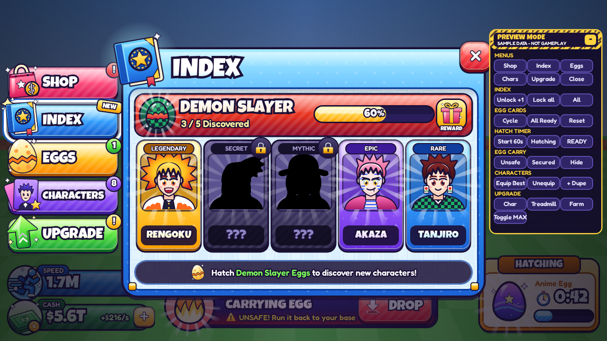
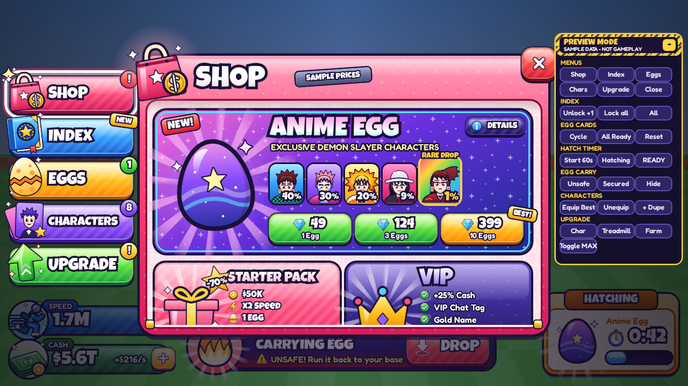
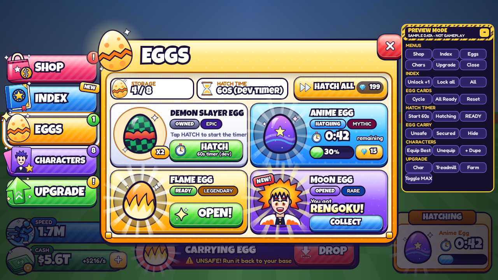
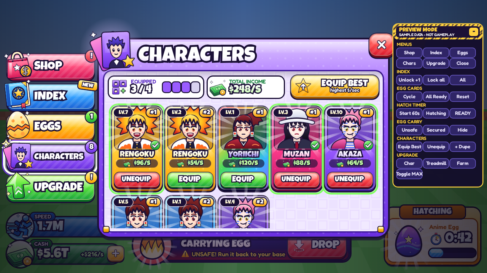
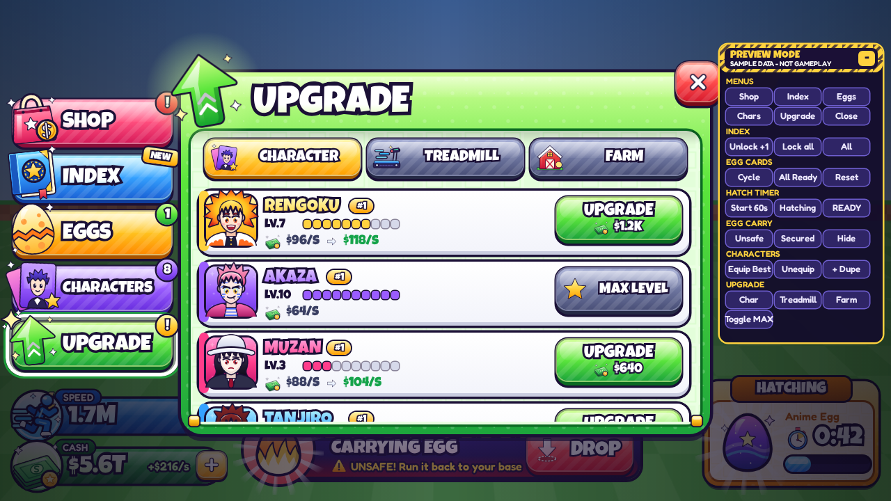

# StealAnimeEgg-UI-Lab

An **independent Roblox UI experiment**: a bright, chunky, premium simulator UI for an
anime-egg game, built as real, editable Roblox GUI instances with original art.
This is **not** the production game: no gameplay, no backend, and all numbers are
**sample data**.



| Shop | Eggs (all 4 states) | Characters | Upgrade |
|---|---|---|---|
|  |  |  |  |

> Screenshots come from the browser preview (`preview/index.html`), which renders the
> same instance tree with Roblox layout rules.
> **ROBLOX STUDIO VISUAL VERIFICATION: NOT PERFORMED** (no Studio in the build
> environment). See `docs/VISUAL_REVIEW.md`.

## What's inside

* **Main navigation:** Shop · Index · Eggs · Characters · Upgrade (no Rebirth). Chunky
  3-layer buttons with overflowing icons, badges, and hover, pressed and selected states.
* **Speed + Cash HUD:** original blue sprinting speed emblem, cash stack, caption tabs,
  `+` buttons, income rate.
* **Shop:** featured Anime Egg with drop chances + 1/3/10 prices, Starter Pack, VIP,
  Cash Packs, Boosts, Special Packs (sample prices).
* **Index:** *Demon Slayer · X / 5 Discovered* + progress bar; locked characters keep a
  **black body silhouette** and `???`.
* **Eggs:** OWNED / HATCHING / READY / OPENED with a 60 s dev timer.
* **Characters:** separate duplicate units (Rengoku #1, #2…), level, $/sec, Equip /
  Unequip, **Equip Best (by $/sec only)**.
* **Upgrade:** CHARACTER (upgrade / MAX LEVEL), TREADMILL (speed gain), FARM (character
  slots). No boxing bag.
* **Egg carry:** UNSAFE (hazard banner + DROP) / SECURED (no DROP).
* **Hatch timer widget:** HATCHING → READY → OPEN.
* **Preview system:** yellow hazard-taped `PREVIEW_Panel` + `PREVIEW_Controller` +
  `PREVIEW_SampleData`, all clearly isolated and deletable.

## Downloads

| Path | |
|---|---|
| `dist/StealAnimeEgg_UI_Lab.rbxmx` | editable ScreenGui model (XML) |
| `dist/StealAnimeEgg_UI_Lab.rbxm` | same, binary (Rojo 7.7 serializer) |
| `dist/StealAnimeEgg_UI_Lab_Demo.rbxlx` | playable demo place |
| `dist/StealAnimeEgg_UI_Lab_COMPLETE.zip` | everything: packages, Rojo source, SVG/PNG art, preview, docs |

**Start here:** [`docs/IMPORT_GUIDE.md`](docs/IMPORT_GUIDE.md) covers the 9 image uploads
and the `AssetIds` step.

## Repository layout

```
assets/svg/            53 original SVG sources (icons, eggs, portraits, FX, patterns)
assets/png/            rendered PNGs + atlas/atlas_a..c.png (1024² upload atlases)
assets/asset-manifest.json  AssetKey -> atlas rect
src/gui/*.rbxmx        GUI frames (generated, Rojo sources)
src/client/*.lua       Main, UIController, AssetBinder, AssetIds, Theme,
                       PREVIEW_Controller, PREVIEW_SampleData (generated), AssetManifest (generated)
src/studio/            Command Bar helper to apply image ids in edit mode
preview/index.html     browser preview (works from file://)
tools/                 generators: art, model, preview, screenshots, Lune tests
docs/                  reference analysis, design system, hierarchy, import guide, visual review
default.project.json   Rojo demo place  |  package.project.json  Rojo ScreenGui model
```

## Rebuild

```bash
cd tools && npm install          # fonts + playwright (uses system Chromium)
node render-art.js               # SVG -> PNG + atlases + contact sheet
node build.js                    # GUI tree -> src/gui, preview data, Luau data, dist/ (needs rojo)
node screenshots.js              # docs/screenshots/*
lune run tests/verify_model.luau # (from repo root) headless model + preview-logic tests
```

Fonts: Luckiest Guy and Fredoka (SIL Open Font License) are embedded only in the browser
preview; in Roblox the built-in font families are used. All art is original.
